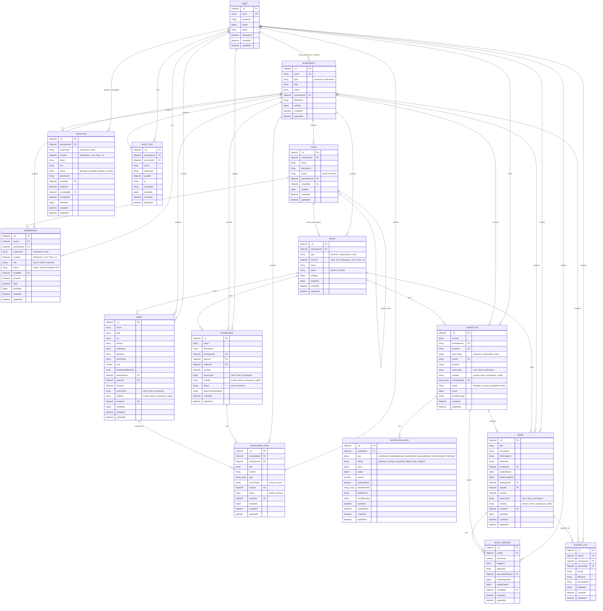
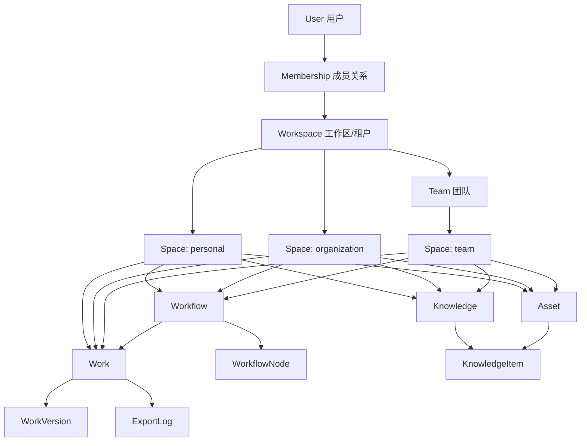

# Brand Flow AI 数据库设计

本文档描述后端当前采用的多租户与资源归属模型。当前设计已经不再以 `Enterprise` 作为核心表，而是统一使用 `Workspace + Space + Membership`。

## 完整 ER 图



## 关系说明图



## 设计目标

1. 支持个人用户独立使用系统，不要求必须加入企业或团队。
2. 支持组织级协作，组织下可以有组织空间、团队空间和成员自己的个人空间。
3. 所有业务资源都有明确的租户边界，必须归属于一个 `workspaceId`。
4. 所有可创作、可沉淀、可展示的业务资源必须归属于一个 `spaceId`。
5. 用户和组织、团队的关系通过独立的 `Membership` 表表达，不再放在 `User` 子数组里。
6. 前端不直接声明资源 owner，后端根据 `spaceId` 推导 `ownerId / ownerType / visibility`。

## 核心模型

```text
User
  |
  | Membership
  v
Workspace 1 ── n Team
    |
    └── n Space
          |
          ├── Knowledge
          ├── Asset
          ├── Workflow
          └── Work
```

`Workspace` 是租户边界。它有两种类型：

```text
personal      个人工作区，注册时自动创建
organization 组织工作区，用户创建企业时创建
```

`Space` 是业务资源容器。它有三种类型：

```text
personal      个人空间
organization 组织空间
team          团队空间
```

`Membership` 是用户权限关系。它有两种 scope：

```text
workspace     用户属于某个 workspace
team          用户属于某个 team
```

## 表设计

### User

用户身份表，只保存账号、密码、资料和状态。

关键字段：

```text
email
password
profile
status
lastLoginAt
```

设计原则：

```text
User 不保存当前 workspace
User 不保存 memberships 子数组
User 只表达用户本身，不表达组织关系
```

原因是组织关系会频繁变动，放入 `Membership` 独立表更利于查询、索引、权限审计和后续扩展。

### Workspace

工作区表，是系统的租户边界。

关键字段：

```text
name
type: personal | organization
logo
status
ownerUserId
billingPlan
settings
```

约束与索引：

```text
name unique
type + ownerUserId
status + updatedAt
```

创建规则：

```text
用户注册 -> 自动创建 personal workspace
用户创建企业 -> 创建 organization workspace
```

`personal workspace` 解决“用户不加入企业也能使用系统”的问题。  
`organization workspace` 解决企业协作、团队、成员管理、企业级资源隔离问题。

### Space

空间表，是业务资源的统一容器。

关键字段：

```text
workspaceId
type: personal | organization | team
ownerId
name
status
settings
metadata
```

唯一约束：

```text
workspaceId + type + ownerId unique
```

`ownerId` 的含义由 `type` 决定：

```text
type = personal      ownerId = User._id
type = organization  ownerId = Workspace._id
type = team          ownerId = Team._id
```

`Space` 会推导业务资源的归属：

```text
personal      -> ownerType=user,      visibility=private
organization  -> ownerType=workspace, visibility=workspace
team          -> ownerType=team,      visibility=team
```

业务模块创建资源时只接收 `spaceId`。后端通过 `OrgService.resolveAccessibleSpace()` 校验权限并推导资源归属，避免前端伪造 owner。

### Membership

成员关系表，表达用户属于哪个 workspace 或 team。

关键字段：

```text
userId
workspaceId
scopeType: workspace | team
scopeId
role
status
invitedBy
joinedAt
leftAt
metadata
```

`scopeId` 的含义由 `scopeType` 决定：

```text
scopeType = workspace  scopeId = Workspace._id
scopeType = team       scopeId = Team._id
```

唯一约束：

```text
userId + scopeType + scopeId unique
```

权限判断规则：

```text
访问 workspace 资源 -> 需要 active workspace membership
访问 team 资源      -> 需要 active team membership
管理资源            -> 需要 OWNER 或 ADMIN
访问 personal space -> 必须 space.ownerId === 当前 userId
```

### Team

团队表，隶属于某个 workspace。

关键字段：

```text
workspaceId
name
description
status
createdBy
```

创建团队时会同步创建：

```text
Team
Team Membership: 创建者 OWNER
Team Space
AuditLog
```

### Invitation

邀请表，用于记录邀请关系和后续扩展邀请流程。

关键字段：

```text
workspaceId
scopeType: workspace | team
scopeId
email
role
status
invitedBy
acceptedBy
expiresAt
```

当前代码中邀请空间成员时会直接把已注册用户加入 `Membership`，并写审计日志。后续可以扩展为邮件邀请、token 接受、过期处理。

### AuditLog

审计日志表，用于记录组织和空间内的重要操作。

关键字段：

```text
workspaceId
actorUserId
action
targetType
targetId
metadata
```

所有组织级操作都应该带 `workspaceId`，方便按租户查询和审计。

## 业务资源表

业务资源统一遵循下面的归属字段：

```text
workspaceId
spaceId
ownerId
ownerType
visibility
creatorId 或 userId
```

### Knowledge

知识库表。

关键字段：

```text
name
description
workspaceId
spaceId
creatorId
ownerId
ownerType
visibility
status
pineconeNamespace
```

规则：

```text
创建知识库必须传 spaceId
知识库只能属于一个 space
工作流只能选择当前创作 space 下的知识库
最多选择 3 个知识库
```

### KnowledgeItem

知识条目表，隶属于某个 Knowledge。

关键字段：

```text
knowledgeId
workspaceId
title
content
tags
sourceType
assetId
status
creatorId
metadata
```

文本入库会调用 agent 层进行切片和向量化。当前 agent 接口参数仍叫 `enterpriseId`，后端以 `workspaceId` 传入，这是过渡命名，不影响业务模型。

### Asset

素材资产表。

关键字段：

```text
name
type
url
bucket
objectKey
fileName
mimeType
size
thumbnailObjectKey
workspaceId
spaceId
ownerId
ownerType
visibility
creatorId
metadata
```

规则：

```text
创建或上传资产必须传 spaceId
上传文件对象 key 使用 spaceId 分区
保存到知识库时会校验资产和知识库访问权限
```

### Workflow

智能创作工作流表。

关键字段：

```text
prompt
workspaceId
spaceId
spaceType
userId
ownerId
ownerType
visibility
knowledgeIds
status
result
errorMessage
```

规则：

```text
创建工作流必须传 spaceId
knowledgeIds 必须属于同一个 space
工作流创建后继承 space 的 owner 和 visibility
后续访问工作流必须校验 workspaceId
个人空间工作流只能本人访问
```

### Work

最终作品表。

关键字段：

```text
title
description
finalImageUrl
objectKey
workflowId
qualityReport
nodesSnapshot
workspaceId
spaceId
ownerId
ownerType
visibility
creatorId
metadata
```

规则：

```text
创建作品必须传 workflowId
作品不接收前端传入的 owner 信息
作品继承 workflow 的 workspaceId / spaceId / ownerId / ownerType / visibility
```

这样可以防止前端把个人工作流保存成组织作品，或把团队工作流保存到其他空间。

## 登录与切换流程

### 注册

```text
POST /auth/register
  -> 创建 User
  -> 创建 personal Workspace
  -> 创建 workspace Membership: OWNER
  -> 创建 personal Space
```

### 登录

```text
POST /auth/login
  -> 查询用户第一个 active workspace membership
  -> JWT 写入 workspaceId 和 role
  -> 返回 activeWorkspaceId
```

JWT 中的 `workspaceId` 是当前请求上下文的租户边界。

### 切换 Workspace

```text
PUT /org/workspace/:id/switch
  -> 校验用户属于目标 workspace
  -> 确保该 workspace 下有当前用户 personal space
  -> 返回新的 access_token
```

前端必须用新的 `access_token` 替换旧 token，否则后续接口仍然会使用旧 workspace。

### 获取 Space

```text
GET /org/spaces
  -> 返回当前用户可访问的 spaces
```

前端创建知识库、资产、工作流时，需要传入对应的 `spaceId`。

## 权限边界

系统必须始终满足以下规则：

```text
所有业务资源必须有 workspaceId
所有创作资源必须有 spaceId
业务模块不信任前端传入 ownerId / ownerType / visibility
personal space 只能 owner 本人访问
team space 只能 team member 访问
organization space 只能 workspace member 访问
跨 workspace 访问必须拒绝
管理操作必须要求 OWNER 或 ADMIN
```

这些规则由 `OrgService.resolveAccessibleSpace()` 和各业务服务的读取、写入权限检查共同保证。

## 推荐前端调用顺序

```text
1. 登录，保存 access_token 和 activeWorkspaceId
2. GET /org/workspaces，展示可切换 workspace
3. GET /org/spaces，展示可创作空间
4. 创建知识库 / 上传资产 / 创建工作流时传 spaceId
5. 切换 workspace 后，替换后端返回的新 access_token
```

## 当前注意事项

1. `Workspace` 表的 `name` 当前是全局唯一。生产环境如果允许不同组织重名，需要改为 slug 或引入唯一短码。
2. `Invitation` 表已经存在，但当前邀请流程仍偏同步，后续可以扩展为邮件 token 接受。
3. agent 包内部仍有 `enterpriseId` 命名，后端现在把 `workspaceId` 映射过去，后续应该统一重命名。
4. `Workflow` 当前部分字段使用 string 保存 ObjectId，其他资源多用 `Types.ObjectId`。后续可以统一为 ObjectId，减少比较时的类型转换。
