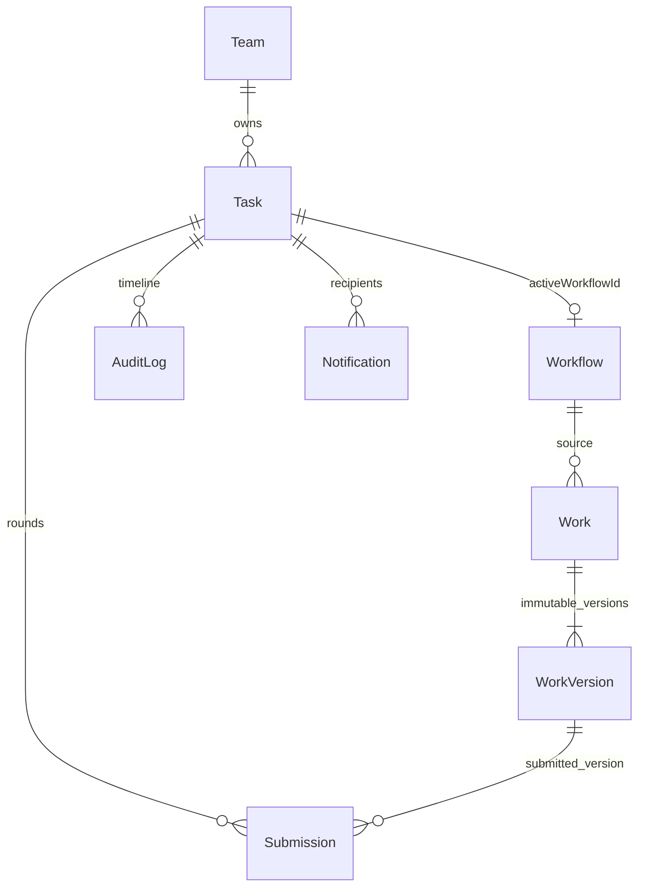

# V3 任务闭环与发布验收

验收日期：2026-10-11。分支：`codex/UI`。本阶段延续 V1 个人创作、V2 企业团队协作，新增单负责人任务派发与成果审核。

## 数据关系与一致性



Task 的业务状态独立于 Workflow 技术状态；Workflow 完成不会自动完成 Task。任务开始在同一 Mongo 事务内创建 Workflow/节点并更新 activeWorkflowId；一次只允许一个有效执行。创建请求携带 UUID requestId，唯一索引和内容指纹防止网络重试或并发双击生成第二个任务。其他命令使用 version 和合法状态 CAS，过期请求返回 409。

Submission 不覆盖 workId/workVersionId/round/comment，审核只处理最新 reviewing 记录。驳回理由必填，返修复用同一 Workflow 并创建新 Revision；重交必须使用新完成版本。任务作品禁止删除，以保留审核历史。业务变更、活动与通知在同一事务提交，审计失败会回滚业务。

新增 tasks/submissions 集合；Workflow 增加可选 taskId，旧个人执行无需迁移。索引包括 Task 租户/团队/状态/负责人/截止日期、创建者/requestId 部分唯一索引、Submission taskId/round 唯一索引。发布时检查 `getIndexes()`，确认新索引建成后开放流量；不要用 syncIndexes 删除历史索引。本次仅写入随机验收库，未迁移业务数据。

## 权限矩阵

角色以服务端当前团队/企业成员关系计算。Outsider 无读写权限，跨租户资源用归属查询隔离；客户端不能指定真实 actor/enterpriseId。

| 操作                                 | Owner/Admin    | Member         | Viewer |
| ------------------------------------ | -------------- | -------------- | ------ |
| 列表、详情、时间线、提交历史         | 可读           | 可读           | 可读   |
| 创建、编辑草稿、派发、取消、删除草稿 | 允许           | 禁止           | 禁止   |
| 接受、拒绝、开始、创作、提交、返修   | 仅本人为负责人 | 仅本人为负责人 | 禁止   |
| 审核通过、驳回                       | 允许           | 禁止           | 禁止   |
| 团队管理统计                         | 允许           | 禁止           | 禁止   |
| 我的任务统计、本人通知、标记已读     | 允许           | 允许           | 允许   |

任务输出模式与要求在派发前确定，开始后不允许通过 Workflow 修改纯图/图文模式。管理者可审核和取消任务，不能替代负责人执行。

## 通知、仪表盘与运维

通知中心 `/notifications` 读取本人最近 50 条记录及全量未读数，每 30 秒刷新，标记已读可重复操作。派发、接受/拒绝、提交、驳回/通过及取消复用服务端 ActivityService。任务详情时间线按任务与租户查询，不接受客户端 actor；系统提醒无 actorId，UI 显示“系统”。拒绝理由仅保留在 task.decline 的受限审计字段，其余 metadata 仍脱敏。

TasksOperationsService 启动时及每小时扫描未来 24 小时截止或已逾期的有效任务。deadlineNotifiedFor/overdueReportedFor 标记与通知同事务提交，重复扫描及多实例竞争不重复通知；已完成/取消不再提醒。本轮最多 500 条，超量下轮继续，尚未进行规模压测。收件人是创建者和仍有访问权的负责人。

`GET /tasks/dashboard?teamId=...` 使用 Mongo 聚合，返回 mine 和仅管理者可见的 manager。逾期为派生数据；本周完成按上海时区周一零点和 completedAt 计算。

结构化日志含 workflow_started/completed/failed、queue_wait、node_duration、provider_failure；每小时任务运营日志汇总 task_created/completed/overdue 与 submission_approved/rejected。日志不增加完整 Prompt、模型响应或密钥。任务运营失败记录 task_operations_failure，应配置告警。

既有 WorkflowRecoveryService 每分钟检查失联 running 执行与孤儿名额，保留检查点并允许重试。Task 对账每小时检查超过五分钟的 in_progress：返修切换状态后、创建新 Revision 前崩溃，恢复为 rejected 并通知负责人；Workflow 与 Task 双 CAS 防止覆盖新执行。找不到关联执行会记录 task_execution_missing，需人工检查数据库与队列，不制造完成结果。

## 验收命令与矩阵

运行 Node.js 24+、pnpm 10.29.3；Docker 可用并提前准备 mongo:8.0、redis:7.4-alpine、dxflrs/garage:v2.3.0。浏览器使用本机 Edge 和现有 Playwright，不新增项目依赖。

```powershell
pnpm lint
pnpm test
pnpm build
pnpm test:v1 mongodb://127.0.0.1:27018 '<Playwright-node_modules绝对路径>'
pnpm test:v2 mongodb://127.0.0.1:27019 '<Playwright-node_modules绝对路径>'
pnpm test:v3 mongodb://127.0.0.1:27019 '<Playwright-node_modules绝对路径>'
git diff --check
```

27018/27019 必须为专用测试 Mongo 副本集，6381 为专用 Redis。Mongo 内部监听27019，副本集通告127.0.0.1:27019，宿主机27018/27019映射该端口。脚本使用随机数据库、队列前缀和 Garage 凭据并清理自己的资源；不可传业务数据库。本轮模型显式 Demo，真实 Mongo/BullMQ/S3 对象与浏览器交互均实际执行。

以下为本轮实际执行结果。故障注入产生的预期 HTTP500 已断言事务回滚/补偿，并非忽略失败；最终未删除、跳过或放宽测试。

| 场景               | 验收内容                                                                       | 本轮结果                                                                     |
| ------------------ | ------------------------------------------------------------------------------ | ---------------------------------------------------------------------------- |
| 根 lint/test/build | 四包质量闸门                                                                   | 通过；API22文件/148项、Web23文件/60项及1项Node SSE、Contracts15项、Agent27项 |
| V1                 | 知识/素材、双账号、纯图/图文、Revision/三版本、合成/下载、断线/刷新、重试/取消 | test:v1 全部通过                                                             |
| V2                 | 五角色组织、知识继承、共享资源、跨企业/跨用户攻击、审计和通知                  | test:v2 全部通过                                                             |
| V3                 | 创建/派发/拒绝/接受、固定要求/强制知识、真实队列故障重试、两轮提交驳回优化通过 | test:v3 全部通过                                                             |
| V3 运营            | 并发创建幂等、重复提醒去重、个人/管理统计隔离、返修中断对账、已读幂等          | 通过；额外验证创建者退出后只提醒有访问权负责人                               |
| production 浏览器  | V1 图文与纯图跳过合成；V3 发布构建提交/审核/历史/工作台/通知                   | Edge headless 通过                                                           |

## 环境、生产启动与部署

本次未新增或修改项目依赖，也未修改本地 .env。环境变量仍见 [API 示例](../apps/api/.env.example) 和 [V1 部署文档](v1-deployment.md)：JWT*SECRET、MONGODB_URI、REDIS*\_、MINIO\_\_、SiliconFlow 配置和执行限额。生产关闭 BRAND_FLOW_DEMO_MODE；KNOWLEDGE_VECTOR_MODE=disabled 可使用 Mongo 品牌规范，但不提供语义向量检索。

使用现有 API/Web Dockerfile 构建带同一发布标签的镜像，通过现有 Nginx 代理 HTTP/SSE 和 SPA。发布前检查 `/health/live`、`/health/ready` 及五角色任务冒烟。

**生产阻塞项：现有 deploy/docker-compose.prod.yml 内置 Mongo 为 standalone，不能承载 V2/V3 事务。** 必须接入经过认证的 Mongo 副本集，包含可访问的成员通告地址。部署层通过 compose override 覆盖 API 的 MONGODB_URI，并先启动 Redis，再以 `--no-deps` 启动 API/Web，避免误用内置 standalone；或由运维提供完整副本集部署。不能仅凭 ping/readiness 认定事务可用，必须实际执行派发/提交及回滚冒烟。

```powershell
docker build -f apps/api/Dockerfile -t brand-flow-api:<release-tag> .
docker build -f apps/web/Dockerfile -t brand-flow-web:<release-tag> .
# 部署层 .env 与 override 保存于仓库外；URI 包含认证和 replicaSet。
docker compose -f deploy/docker-compose.prod.yml -f <部署层override.yml> up -d redis
docker compose -f deploy/docker-compose.prod.yml -f <部署层override.yml> up -d --no-deps api web
```

以上生产命令为操作指南，本轮未连接生产环境、未重建发布镜像或运行生产 Compose。

## 备份、恢复与回滚

1. 发布前停止新写入，排空或暂停工作流队列；记录发布标签、索引、待审核/运行任务和 Redis 队列前缀。
2. 使用部署层凭据执行 mongodump 备份整个业务数据库，包含 tasks、submissions、workflows、workversions、审计/通知；同时备份私有 S3/MinIO 对象、版本与 Redis 持久化文件。备份不得放进 Git。
3. 恢复到独立数据库和桶，运行 mongorestore，检查索引、引用链、历史 PNG 下载、任务 round/version 和系统提醒标记；保留 marker，避免恢复后重复提醒。旧签名 URL 需通过读取 API 刷新。
4. 回滚先停新 API/Worker，禁止不同版本消费同一队列。优先回滚到兼容 Task 数据模型的镜像；回到 V3 前版本会丢失任务功能，必须隔离新数据，必要时从发布前数据库/S3 一致备份恢复并明确损失窗口。不要删除数据卷或用 Git 历史重写替代回滚。

本轮没有进行生产备份恢复演练；正式上线前必须在预发布环境演练上述步骤。

## 已知限制与正式上线前待验

- 未授权调用付费 SiliconFlow；真实 Provider 图像/视觉模型能力、超时及计费仍需有限 smoke，Demo 通过不代表 Provider 已验收。
- 真实生产 Mongo 认证副本集、Redis 故障切换、MinIO/云 S3 签名/CORS、Nginx 长连接、备份恢复和规模压测未在本轮验证。测试存储为真实 Garage S3-compatible，不声明生产 MinIO 通过。
- 单 assignee、团队内角色审核；不提供视频、计费、复杂多级审批、多人实时画布。成片导出仍仅 PNG。
- 通知页面仅最近50条，未读数覆盖全量；小时级提醒非即时推送。运营扫描批量上限需按实际任务量再调整。
- 现有 Web 大 chunk 与 Ant Design 弃用提示需后续处理；不能因此关闭规则或扩大本次修改。

阶段领域说明见 [Task 状态与权限](task-domain.md)，接口见 [API.md](../apps/api/API.md)。
