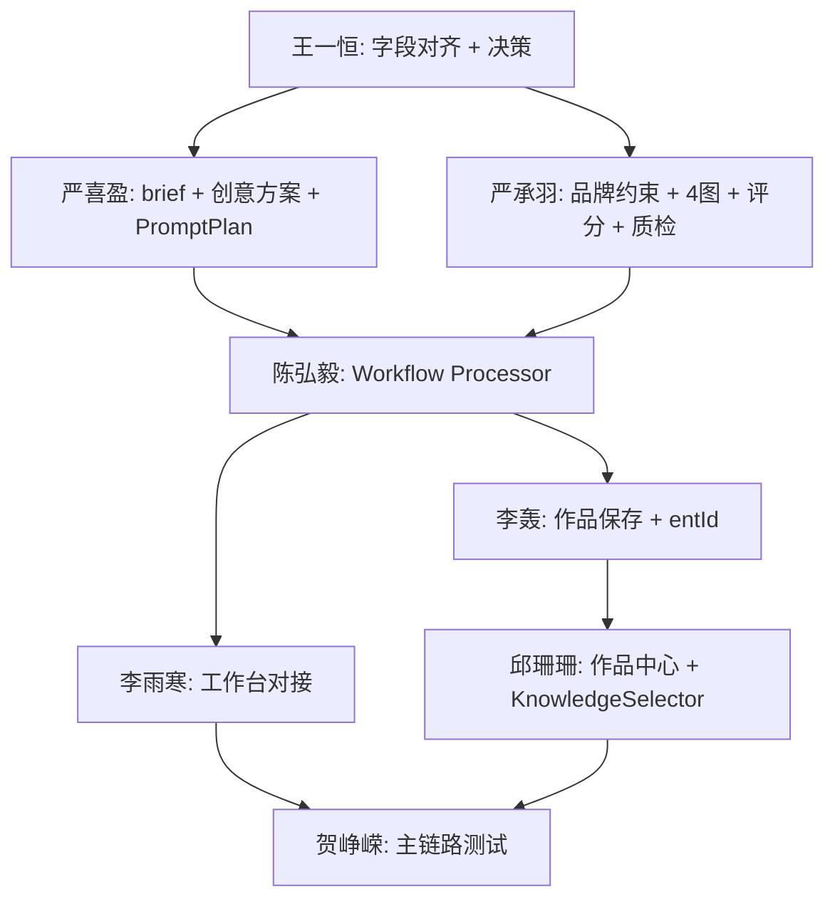

# Brand-Flow V1.0 任务派发清单

> 文档版本：v1.0  
> 生成日期：2026-06-11  
> 依据文档：[v1-development-weekly-plan.md](./v1-development-weekly-plan.md)、[workflow-nodes-module.md](./workflow-nodes-module.md)  
> 审查基准：当前代码库实现状态 vs V1.0 主链路验收标准  
> 适用对象：前端组、Agent 组、后端组、产品组、UI 组、产品负责人

---

## 1. 审查结论摘要

当前处于 **第 2 周（6.8 – 6.14）** 中段，距离 **6.21 主链路联调** 仅剩约 10 天。代码库与 V1.0 计划存在 **架构级偏差**，最大阻塞为：

**计划要求 7 节点流，当前前后端、Agent 仍运行在旧 6 节点模型上。**

### 1.1 主链路对比

| 环节            | V1.0 要求                    | 当前状态                                      |
| --------------- | ---------------------------- | --------------------------------------------- |
| 注册 / 登录     | 可用                         | ✅ 基本可用                                   |
| Space 选择      | personal / team / enterprise | ⚠️ 首页有切换器，工作台创建时可能丢失 Space   |
| 知识库选择      | 最多 3 个，传入工作流        | ❌ 首页无 KnowledgeSelector，未传 knowledgeId |
| 7 节点创作流    | 7 节点白盒展示               | ❌ 前端 6 节点，后端 6 节点，缺「创意方案」   |
| 4 张候选底图    | 固定 4 张 + 评分             | ❌ 仅生成 1 张图，候选评分链未接入            |
| 图文合成 / 跳过 | needsComposition 分支        | ❌ 合成节点为 UI 占位，无 skipped 逻辑        |
| 最终品牌质检    | 分项分、扣分项、回溯建议     | ❌ 当前评估的是 Prompt，非最终成片            |
| 保存作品        | POST /works                  | ❌ 后端有接口，前端零对接                     |
| 作品中心 / 详情 | /works、/work-detail         | ❌ 页面与路由均未实现                         |
| 导出 PNG        | 作品导出接口                 | ❌ 仅浏览器本地下载，未调 /works/:id/export   |

### 1.2 里程碑风险

| 里程碑                           | 日期 | 风险等级                  |
| -------------------------------- | ---- | ------------------------- |
| 静态页面 + 基础接口 + Agent 初版 | 6.14 | 🔴 高                     |
| 主链路联调完成                   | 6.21 | 🔴 高                     |
| 内测版交付                       | 6.30 | 🟡 中（依赖 P0 本周清零） |

---

## 2. 优先级定义

| 级别   | 含义                                   | 处理时限    |
| ------ | -------------------------------------- | ----------- |
| **P0** | 阻塞主链路，不修复则 6.21 无法联调     | 6.11 – 6.14 |
| **P1** | 影响体验与演示稳定性，联调后一周内完成 | 6.15 – 6.21 |
| **P2** | 可延后到功能冻结后或 V1.1              | 6.22 以后   |

---

## 3. 跨组阻塞项（需王一恒今日决策）

| #   | 决策项                             | 选项                                                             | 建议                                 | 影响范围                       |
| --- | ---------------------------------- | ---------------------------------------------------------------- | ------------------------------------ | ------------------------------ |
| D-1 | 6 节点 → 7 节点迁移策略            | A. 全量拆 7 真实节点；B. 展示 7 节点 + 执行层合并（见计划 12.1） | **B 过渡**，本周先统一数据结构       | 全员                           |
| D-2 | 个人空间无 entId 时知识库/作品策略 | A. 注册默认创建企业；B. personal 模式放宽 entId 校验             | 需产品确认后李轰实施                 | 李轰、邱珊珊                   |
| D-3 | 页面路径命名                       | `/brand` 占位 vs `/assets` 素材页                                | 统一为 `/assets`，brand 合并或重定向 | 邱珊珊、练洋洋                 |
| D-4 | 字段对齐会时间                     | 今日安排 1h 三方对齐 CreativeBrief 等 Schema                     | 今日必开                             | 严喜盈、严承羽、陈弘毅、李雨寒 |

---

## 4. 按人员任务派发

---

### 4.1 陈弘毅（后端 · Auth / Space / Workflow / SSE）

**负责范围：** Workflow、WorkflowNode、SSE、节点重跑、节点 stale/skipped、权限上下文

#### P0 任务

| ID        | 任务                                  | 问题描述                                                                          | 验收标准                                                                                     | 依赖                   |
| --------- | ------------------------------------- | --------------------------------------------------------------------------------- | -------------------------------------------------------------------------------------------- | ---------------------- |
| CHY-P0-01 | 升级 WorkflowNode Schema 为 V1 七节点 | 当前仅 `intentNode/knowledgeNode/promptNode/generateNode/evaluateNode/finishNode` | Schema、枚举、创建时初始化节点与 [workflow-nodes-module.md](./workflow-nodes-module.md) 一致 | D-1 决策               |
| CHY-P0-02 | 修复 spaceId / entId 混乱             | `workflow.processor.ts` 将 `enterpriseId` 错误赋值为 `workflow.spaceId`           | 创建 workflow 时正确写入 entId；Agent context 中 spaceId 与 enterpriseId 分离                | 无                     |
| CHY-P0-03 | 改造 WorkflowProcessor 主链路         | 未调用 4 候选图、候选评分、最终质检；evaluate 评的是 Prompt                       | 顺序执行七节点（或过渡合并节点），generate 产出 4 张候选图                                   | 严喜盈、严承羽 P0 完成 |
| CHY-P0-04 | 实现 composeNode skipped 逻辑         | 无 compose 节点；needsComposition=false 时应 skipped                              | `node_skipped` 事件准确推送；DB 节点 status=skipped                                          | 严喜盈 brief-chain     |
| CHY-P0-05 | 补齐 SSE 事件协议                     | 前端监听 `node_started` 但后端未推送                                              | 支持 `node_started`、`node_completed`、`node_skipped`、`node_failed`、`workflow_completed`   | 李雨寒联调             |
| CHY-P0-06 | 创作接口支持多知识库                  | `CreateWorkflowDto` 仅 `knowledgeId?: string`                                     | 支持 `selectedKnowledgeBaseIds: string[]` 并传入 Agent                                       | 李轰 DTO 对齐          |

#### P1 任务

| ID        | 任务                     | 验收标准                                  |
| --------- | ------------------------ | ----------------------------------------- |
| CHY-P1-01 | 节点重跑端到端验证       | 从任意节点重跑，上游结果保留、下游 stale  |
| CHY-P1-02 | stale 机制与前端状态对齐 | 修改前置节点后，下游节点 DB status=stale  |
| CHY-P1-03 | SSE 长任务断连修复       | 长任务完成后前端能收到 workflow_completed |
| CHY-P1-04 | 演示环境部署准备         | env / build / start 文档齐全              |

**本周交付物：** 七节点 Workflow Schema + Processor 改造 PR + SSE 事件文档更新

---

### 4.2 李轰（后端 · Knowledge / Assets / Works / Export）

**负责范围：** KnowledgeBase、KnowledgeItem、Asset、Upload、Work、WorkVersion、Export

#### P0 任务

| ID       | 任务                    | 问题描述                                                                           | 验收标准                                                                        | 依赖      |
| -------- | ----------------------- | ---------------------------------------------------------------------------------- | ------------------------------------------------------------------------------- | --------- |
| LH-P0-01 | 解决个人空间 entId 阻塞 | `knowledge/works/assets` 均 `assertEnterpriseSelected`，新注册用户无企业则全部失败 | 个人空间可创建知识库、上传素材、保存作品（按 D-2 决策）                         | D-2 决策  |
| LH-P0-02 | 创作接口多知识库字段    | 首页无法传入选中知识库                                                             | DTO 与 Service 支持 `selectedKnowledgeBaseIds[]`                                | CHY-P0-06 |
| LH-P0-03 | 作品保存字段约定        | 前端未对接，字段未对齐                                                             | 输出 `CreateWorkDto` 示例：含 `nodesSnapshot`、`qualityReport`、`finalImageUrl` | 陈弘毅    |
| LH-P0-04 | 导出接口联调支持        | `POST /works/:id/export` 已实现，前端未调用                                        | 提供 rest-client 示例 + 返回 downloadUrl 在演示环境可访问                       | 邱珊珊    |

#### P1 任务

| ID       | 任务               | 验收标准                                        |
| -------- | ------------------ | ----------------------------------------------- |
| LH-P1-01 | 素材上传稳定性     | 上传后 signedUrl 可预览、可删除                 |
| LH-P1-02 | 素材转知识项打通   | `POST /assets/:id/save-to-knowledge` 前端可调用 |
| LH-P1-03 | Space 数据隔离验证 | 不同 Space 下作品/素材不串数据                  |
| LH-P1-04 | 演示数据清理       | 测试脏数据不影响 6.30 演示                      |

**本周交付物：** entId 策略落地 + 作品保存接口联调说明 + 多知识库 DTO

---

### 4.3 严喜盈（Agent · 需求翻译 / 创意方案 / Prompt）

**负责范围：** CreativeBrief、outputMode、needsComposition、textIntent、CreativeDirection、PromptPlan

#### P0 任务

| ID        | 任务                            | 问题描述                                  | 验收标准                                                                | 依赖         |
| --------- | ------------------------------- | ----------------------------------------- | ----------------------------------------------------------------------- | ------------ |
| YXY-P0-01 | 实现 brief-chain                | 当前 `intent-chain` 输出旧 `IntentOutput` | 输出 `CreativeBrief`，含 `outputMode`、`needsComposition`、`textIntent` | D-4 字段对齐 |
| YXY-P0-02 | 实现 creative-direction-chain   | 代码库中完全缺失                          | 一次输出 3 个差异明确的 `CreativeDirection`                             | YXY-P0-01    |
| YXY-P0-03 | 改造 prompt-chain 为 PromptPlan | 当前无 `layoutPlan`、`imagePrompt` 结构   | 输出 `PromptPlan`；`needsComposition=false` 时 `layoutPlan` 为空        | YXY-P0-01    |
| YXY-P0-04 | 编写 JSON Schema 文档           | Agent 输出与前端/后端未对齐               | 在 `packages/agent` 或 docs 补充 Schema + 10 条 mock 样例               | 无           |

#### P1 任务

| ID        | 任务                 | 验收标准                                             |
| --------- | -------------------- | ---------------------------------------------------- |
| YXY-P1-01 | JSON 解析稳定性优化  | 解析失败率显著降低，有兜底结果                       |
| YXY-P1-02 | 3 方案差异度优化     | 风格/构图/色彩维度有明显差异                         |
| YXY-P1-03 | 10 条稳定演示 Prompt | 覆盖 pure_image / graphic_design / scene_text / both |

**本周交付物：** brief + creative-direction + prompt 三链可本地调用 + Schema 文档

---

### 4.4 严承羽（Agent · 品牌约束 / 生成 / 评分）

**负责范围：** BrandConstraintPackage、知识库检索、4 候选图、候选评分、最终质检、回溯建议

#### P0 任务

| ID        | 任务                   | 问题描述                                                               | 验收标准                                                                                  | 依赖      |
| --------- | ---------------------- | ---------------------------------------------------------------------- | ----------------------------------------------------------------------------------------- | --------- |
| YCY-P0-01 | 品牌约束节点接入 Graph | `buildConstraintPackage` 已实现但未进入 `graph.ts`                     | 替换/升级 `knowledgeNode`，输出 `BrandConstraintPackage`（required/recommended/optional） | YXY-P0-01 |
| YCY-P0-02 | 4 候选图生成接入 Graph | `generateFourCandidates` 已实现但 Graph 用 `executeGenerate` 只产 1 张 | generate 节点固定输出 4 张 `CandidateImage`                                               | CHY-P0-03 |
| YCY-P0-03 | 候选图评分接入 Graph   | `evaluateCandidates` 已实现但未引用                                    | 每张候选图有分项评分和推荐状态                                                            | YCY-P0-02 |
| YCY-P0-04 | 最终质检接入 Graph     | `runFinalEvaluation` 已实现但未引用                                    | 输出 `FinalEvaluationResult`：总分、分项分、扣分项、回溯建议                              | YCY-P0-03 |
| YCY-P0-05 | 模型失败降级           | 模型失败时流程崩溃                                                     | 返回可展示错误 + fallback mock 图（演示用）                                               | 无        |

#### P1 任务

| ID        | 任务                 | 验收标准                   |
| --------- | -------------------- | -------------------------- |
| YCY-P1-01 | 推荐理由可解释性优化 | 品牌匹配推荐理由用户可理解 |
| YCY-P1-02 | 自动回溯次数上限     | 最多 2 次，不出现无限循环  |
| YCY-P1-03 | 候选评分与视觉一致性 | 分数与视觉结果基本一致     |

**本周交付物：** 后 4 个 AI 节点（品牌约束、底图、候选评分、最终质检）可本地 + Graph 串联

---

### 4.5 李雨寒（前端 · 工作台 / 节点流）

**负责范围：** /workspace、7 节点导航、SSE、图文合成、品牌质检报告、stale/skipped 展示

#### P0 任务

| ID        | 任务                     | 问题描述                                                 | 验收标准                                                                   | 依赖             |
| --------- | ------------------------ | -------------------------------------------------------- | -------------------------------------------------------------------------- | ---------------- |
| LYH-P0-01 | 改造为 7 节点工作台      | `workspace.const.ts` 仅 6 节点，缺「创意方案」           | 展示：需求翻译、品牌约束、创意方案、Prompt、底图、图文合成、质检           | D-4、练洋洋标注  |
| LYH-P0-02 | 对接新节点数据结构       | IntentPanel 展示旧字段；BrandKbPanel 展示原始字符串      | 各 Panel 展示 CreativeBrief / BrandConstraintPackage / 3 方案 / PromptPlan | Agent P0         |
| LYH-P0-03 | 4 候选图 UI              | ImageGenPanel 仅 1 张底图                                | 4 张候选图网格 + 评分 + 选择按钮                                           | YCY-P0-02/03     |
| LYH-P0-04 | 最终质检报告 UI          | EvalPanel 展示旧 EvaluationResult                        | 展示分项分、扣分项、回溯建议、是否可导出                                   | YCY-P0-04        |
| LYH-P0-05 | 修复 spaceId 硬编码      | `workspace.tsx` startWorkflow 写死 `spaceId: 'personal'` | 使用 store 中当前 Space                                                    | 无               |
| LYH-P0-06 | needsComposition 分支 UI | compose 节点永远被标 done                                | pure_image 显示 skipped；graphic_design 启用合成面板                       | CHY-P0-04        |
| LYH-P0-07 | 工作台「保存作品」       | 仅 `handleSaveImage` 浏览器下载                          | 调用 `POST /works`，保存 nodesSnapshot + qualityReport                     | 邱珊珊 api/works |
| LYH-P0-08 | SSE 状态完整对接         | node_started 收不到；stale 映射为 done                   | 节点状态与后端一致，running 能正常结束或失败                               | CHY-P0-05        |

#### P1 任务

| ID        | 任务                              | 验收标准                          |
| --------- | --------------------------------- | --------------------------------- |
| LYH-P1-01 | stale / skipped / failed 视觉样式 | FlowNode 支持全部状态，用户可区分 |
| LYH-P1-02 | 节点失败 / 重试 UI                | 失败原因可读，有下一步引导        |
| LYH-P1-03 | 图文合成基础编辑                  | 标题 / Logo / 模板，可选位置      |
| LYH-P1-04 | 小屏 / 演示环境响应式             | 演示分辨率下布局正常              |

**本周交付物：** 7 节点工作台 UI + 真实 workflow 数据展示 + 保存作品入口

---

### 4.6 邱珊珊（前端 · 首页 / 知识库 / 素材 / 作品）

**负责范围：** /home、/knowledge、/assets、/works、/work-detail、/profile、SpaceSwitcher、KnowledgeSelector

#### P0 任务

| ID        | 任务                   | 问题描述                                              | 验收标准                                                                       | 依赖      |
| --------- | ---------------------- | ----------------------------------------------------- | ------------------------------------------------------------------------------ | --------- |
| QSS-P0-01 | 补全路由               | `router/index.tsx` 缺 knowledge / works / work-detail | `/knowledge`、`/knowledge/:id`、`/assets`、`/works`、`/work-detail/:id` 可访问 | D-3       |
| QSS-P0-02 | 更新主导航             | AppLayout 仅 home/workspace/brand/profile             | 侧栏含：首页、工作台、知识库、素材、作品中心                                   | 练洋洋    |
| QSS-P0-03 | 首页 KnowledgeSelector | 首页无知识库多选，未传 ID                             | 最多选 3 个；创建 workflow 时传 `selectedKnowledgeBaseIds`                     | LH-P0-02  |
| QSS-P0-04 | 新建 api/works.ts      | 前端无 works API 封装                                 | 封装 create / list / detail / export / delete                                  | 无        |
| QSS-P0-05 | 作品中心页             | 完全缺失                                              | 作品卡片列表、筛选、操作按钮                                                   | QSS-P0-04 |
| QSS-P0-06 | 作品详情页             | 完全缺失                                              | 预览、节点记录、质检报告、导出入口                                             | QSS-P0-04 |
| QSS-P0-07 | 素材页接入 API         | AssetsPanel 有 TODO；brand/index 是占位               | 列表、上传、删除可用；替换或整合 brand 占位页                                  | LH-P0-01  |
| QSS-P0-08 | 修复首页退出按钮       | 顶部「退出」无 onClick                                | 调用 logout 并跳转 /login                                                      | 无        |

#### P1 任务

| ID        | 任务                      | 验收标准                            |
| --------- | ------------------------- | ----------------------------------- |
| QSS-P1-01 | ExportModal               | 至少 PNG 可用，调 /works/:id/export |
| QSS-P1-02 | 上传失败明确提示          | 素材上传错误有文案                  |
| QSS-P1-03 | 统一 Material 风格        | 各页面视觉与 Design System 一致     |
| QSS-P1-04 | 个人中心与 Space 数据打通 | profile 企业与首页 Space 切换一致   |

**本周交付物：** 首页 KnowledgeSelector + 知识库/素材/作品中心静态页接入真实接口

---

### 4.7 贺峥嵘（产品 · 原型 / 测试 / 验收）

#### P0 任务

| ID        | 任务                      | 验收标准                                |
| --------- | ------------------------- | --------------------------------------- |
| HZR-P0-01 | 更新 V1 验收表            | 每个模块标注：已实现 / 部分 / 未实现    |
| HZR-P0-02 | 编写可执行主链路测试用例  | 按修复顺序排列，覆盖 P0 主链路 11 步    |
| HZR-P0-03 | 空状态 / 错误状态清单核对 | 无知识库、生成失败、权限不足等有对应 UI |

#### P1 任务

| ID        | 任务               | 验收标准                       |
| --------- | ------------------ | ------------------------------ |
| HZR-P1-01 | 第一轮联调测试记录 | 问题清单含复现步骤与优先级     |
| HZR-P1-02 | 演示流程脚本       | 用户从登录到导出的一条完整路径 |
| HZR-P1-03 | P0/P1/P2 bug 表    | 6.28 前 P0 清零依据            |

---

### 4.8 练洋洋（UI · 设计系统 / 高保真 / 标注）

#### P0 任务

| ID        | 任务                        | 验收标准                               |
| --------- | --------------------------- | -------------------------------------- |
| LYY-P0-01 | 7 节点工作台标注补齐        | 含创意方案节点、4 候选图、skipped 状态 |
| LYY-P0-02 | KnowledgeSelector 组件设计  | 最多 3 个、强制知识库锁定态            |
| LYY-P0-03 | 作品中心 / 作品详情高保真   | 前端可按标注实现                       |
| LYY-P0-04 | 质检报告 / 候选评分视觉规范 | 分项分、扣分项、回溯建议样式           |

#### P1 任务

| ID        | 任务                                     | 验收标准           |
| --------- | ---------------------------------------- | ------------------ |
| LYY-P1-01 | stale / skipped / 空 / 错 / 禁用状态补齐 | 组件状态完整       |
| LYY-P1-02 | 最终 UI 走查与标注修订                   | 与前端还原效果对齐 |
| LYY-P1-03 | Figma 交付包整理                         | 6.30 前可交付      |

---

### 4.9 王一恒（产品负责人 · 协调 / 验收 / 演示）

#### P0 任务

| ID        | 任务                        | 验收标准                                                                             |
| --------- | --------------------------- | ------------------------------------------------------------------------------------ |
| WYH-P0-01 | 今日完成 D-1 ~ D-4 四项决策 | 结论写入本文档 §3 或会议纪要                                                         |
| WYH-P0-02 | 组织字段对齐会              | CreativeBrief / BrandConstraintPackage / PromptPlan / FinalEvaluationResult 三方一致 |
| WYH-P0-03 | 重排本周优先级              | 确认本周只保：首页→7节点→4图→质检→保存→作品中心→导出 PNG                             |
| WYH-P0-04 | 每日站会跟踪 P0 清零        | 使用 §6 同步模板                                                                     |

#### P1 任务

| ID        | 任务                         | 验收标准         |
| --------- | ---------------------------- | ---------------- |
| WYH-P1-01 | 组织 6.21 第一次完整联调验收 | 输出联调报告     |
| WYH-P1-02 | 准备 Demo 账号与演示 Prompt  | 10 条稳定样例    |
| WYH-P1-03 | V1.1 需求池整理              | 本期裁剪项有记录 |

---

## 5. 任务依赖与执行顺序

```text
Day 1（6.11）
├── 王一恒：D-1 ~ D-4 决策 + 字段对齐会
├── 严喜盈：brief-chain + Schema 文档
└── 严承羽：品牌约束节点方案确认

Day 2–3（6.12 – 6.13）
├── 严喜盈：creative-direction + PromptPlan 链
├── 严承羽：4候选图 + 候选评分 + 最终质检接入 Graph
├── 陈弘毅：Workflow Schema + Processor + SSE
└── 李轰：entId 策略 + 多知识库 DTO + 作品字段约定

Day 4–5（6.14 – 6.15）
├── 李雨寒：7节点工作台 + 新数据结构 + 保存作品
├── 邱珊珊：路由 + KnowledgeSelector + 作品中心/详情 + api/works
└── 贺峥嵘：更新验收表 + 主链路测试用例

Week 3（6.15 – 6.21）
└── 全员联调 → 王一恒第一次完整验收
```



---

## 6. 每周同步模板

各负责人在站会按以下格式更新对应任务状态（将 `[ ]` 改为 `[x]`）：

```text
负责人：
本周目标：

本周已完成：
1.
2.

未完成事项：
1.

当前阻塞：
1.

需要王一恒协调：
1.

风险等级：低 / 中 / 高
```

---

## 7. P0 任务总览（快速查阅）

| ID        | 负责人 | 任务摘要                 | 状态 |
| --------- | ------ | ------------------------ | ---- |
| CHY-P0-01 | 陈弘毅 | 七节点 Workflow Schema   | [ ]  |
| CHY-P0-02 | 陈弘毅 | 修复 spaceId/entId 混乱  | [ ]  |
| CHY-P0-03 | 陈弘毅 | Processor 主链路改造     | [ ]  |
| CHY-P0-04 | 陈弘毅 | compose skipped 逻辑     | [ ]  |
| CHY-P0-05 | 陈弘毅 | SSE 事件协议补齐         | [ ]  |
| CHY-P0-06 | 陈弘毅 | 多知识库字段支持         | [ ]  |
| LH-P0-01  | 李轰   | 个人空间 entId 策略      | [ ]  |
| LH-P0-02  | 李轰   | 多知识库 DTO             | [ ]  |
| LH-P0-03  | 李轰   | 作品保存字段约定         | [ ]  |
| LH-P0-04  | 李轰   | 导出接口联调支持         | [ ]  |
| YXY-P0-01 | 严喜盈 | brief-chain              | [ ]  |
| YXY-P0-02 | 严喜盈 | creative-direction-chain | [ ]  |
| YXY-P0-03 | 严喜盈 | PromptPlan 链            | [ ]  |
| YXY-P0-04 | 严喜盈 | JSON Schema + mock 样例  | [ ]  |
| YCY-P0-01 | 严承羽 | 品牌约束接入 Graph       | [ ]  |
| YCY-P0-02 | 严承羽 | 4 候选图接入 Graph       | [ ]  |
| YCY-P0-03 | 严承羽 | 候选评分接入 Graph       | [ ]  |
| YCY-P0-04 | 严承羽 | 最终质检接入 Graph       | [ ]  |
| YCY-P0-05 | 严承羽 | 模型失败降级             | [ ]  |
| LYH-P0-01 | 李雨寒 | 7 节点工作台             | [ ]  |
| LYH-P0-02 | 李雨寒 | 新节点数据结构对接       | [ ]  |
| LYH-P0-03 | 李雨寒 | 4 候选图 UI              | [ ]  |
| LYH-P0-04 | 李雨寒 | 最终质检报告 UI          | [ ]  |
| LYH-P0-05 | 李雨寒 | 修复 spaceId 硬编码      | [ ]  |
| LYH-P0-06 | 李雨寒 | needsComposition 分支    | [ ]  |
| LYH-P0-07 | 李雨寒 | 保存作品入口             | [ ]  |
| LYH-P0-08 | 李雨寒 | SSE 状态完整对接         | [ ]  |
| QSS-P0-01 | 邱珊珊 | 补全路由                 | [ ]  |
| QSS-P0-02 | 邱珊珊 | 更新主导航               | [ ]  |
| QSS-P0-03 | 邱珊珊 | KnowledgeSelector        | [ ]  |
| QSS-P0-04 | 邱珊珊 | api/works.ts             | [ ]  |
| QSS-P0-05 | 邱珊珊 | 作品中心页               | [ ]  |
| QSS-P0-06 | 邱珊珊 | 作品详情页               | [ ]  |
| QSS-P0-07 | 邱珊珊 | 素材页接入 API           | [ ]  |
| QSS-P0-08 | 邱珊珊 | 修复首页退出             | [ ]  |
| HZR-P0-01 | 贺峥嵘 | 更新验收表               | [ ]  |
| HZR-P0-02 | 贺峥嵘 | 主链路测试用例           | [ ]  |
| HZR-P0-03 | 贺峥嵘 | 空错状态清单             | [ ]  |
| LYY-P0-01 | 练洋洋 | 7 节点工作台标注         | [ ]  |
| LYY-P0-02 | 练洋洋 | KnowledgeSelector 设计   | [ ]  |
| LYY-P0-03 | 练洋洋 | 作品页高保真             | [ ]  |
| LYY-P0-04 | 练洋洋 | 质检/评分视觉规范        | [ ]  |
| WYH-P0-01 | 王一恒 | 四项决策                 | [ ]  |
| WYH-P0-02 | 王一恒 | 字段对齐会               | [ ]  |
| WYH-P0-03 | 王一恒 | 重排优先级               | [ ]  |
| WYH-P0-04 | 王一恒 | 每日 P0 跟踪             | [ ]  |

---

## 8. 关键代码问题索引（研发定位用）

| 文件                                                            | 问题                                              |
| --------------------------------------------------------------- | ------------------------------------------------- |
| `apps/web/src/pages/workspace/workspace.const.ts`               | 仅 6 节点，缺创意方案                             |
| `apps/api/src/modules/workflow/workflow.processor.ts`           | 6 节点执行；`enterpriseId: workflow.spaceId` 错误 |
| `apps/api/src/modules/workflow/schemas/workflow-node.schema.ts` | 节点枚举未升级 V1 七节点                          |
| `packages/agent/src/ai-logic/graph.ts`                          | 旧 Graph；未接入 4 图/候选评分/最终质检           |
| `packages/agent/src/ai-logic/chains/intent-chain.ts`            | 旧 IntentOutput，非 CreativeBrief                 |
| `packages/agent/src/brand/brand-service.ts`                     | `buildConstraintPackage` 未接入 Graph             |
| `packages/agent/src/generate/generate-service.ts`               | `generateFourCandidates` 未接入 Graph             |
| `apps/web/src/router/index.tsx`                                 | 缺 knowledge / works / work-detail 路由           |
| `apps/web/src/pages/home/home.tsx`                              | 无 KnowledgeSelector；退出按钮无效                |
| `apps/web/src/pages/brand/index.tsx`                            | 占位页，AssetsPanel 未挂载                        |
| `apps/web/src/pages/workspace/workspace.tsx`                    | spaceId 硬编码 personal；无保存作品               |

---

## 9. 文档维护说明

- 本文档由代码审查生成，随实现进度在站会中更新 §7 状态列。
- 决策结论（§3）由王一恒确认后填入，作为后续 PR 验收依据。
- 与 [v1-development-weekly-plan.md](./v1-development-weekly-plan.md) 冲突时，以 **已确认的 V1.0 范围冻结** 为准。
- 新增需求一律进入 V1.1 需求池，不在本文档 P0 列表追加。

---

_最后更新：2026-06-11_
